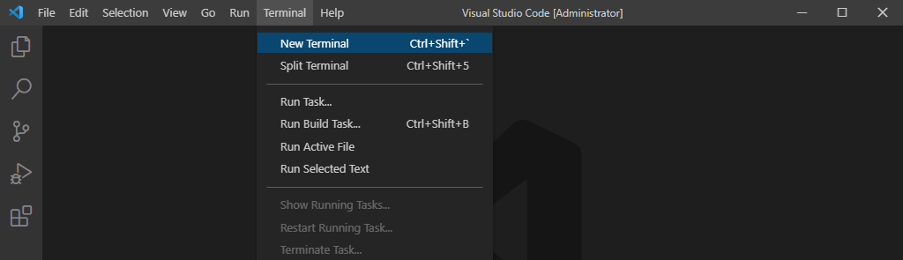

# Установка терминала CMD для VSCode по умолчанию (для Windows)

1. Выполните команду меню **Terminal** >> **New terminal**

2. В окне терминалов разверните список и выберите **Select Default Profile**

3. В появшемся окне выберите **Command Prompt**

4. Закройте терминал Powershall и откройте заново окно терминалов, или перезапустите VSCode
