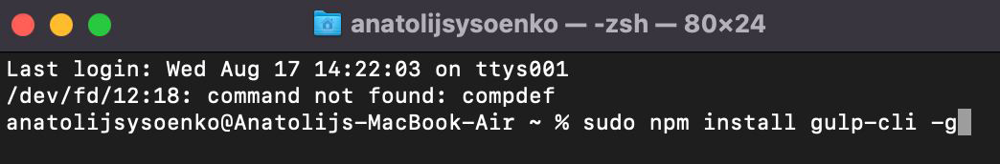

# 1. Скачайте и установите node.js

LTS версия https://nodejs.org/

> После установки программы **необходимо перезагрузить компьютер!**

# 2. Проверьте корректность установки node.js и npm

Для проверки правильности установки
**node.js**
в командной строке выполнить:

```
node -v
```

Для проверки правильности установки
**npm**
в командной строке выполнить:

```
npm -v
```

<!-- два пробела + enter = разрыв строки -->

> Если в результате вы увидите версии **_node.js_** и **_npm_** - установка успешна.
> В противном случае - ищите ошибку, продолжать не имеет смысла.

# 3. Установите gulp-cli глобально

## 3.1. Откройте консоль в папке проекта

**ОЧЕНЬ ВАЖНО!**  
В путях к проекту, как и внутри проекта, (нигде) не должно быть киррилицы, пробелов и спецсимволов!  
Это приведет к 100% вероятности появления ошибок в работе скриптов.

**ВАЖНО! Для WINDOWS!**  
Не используйте консоль **PowerShell**, замените ее встроенной **Cmd**.  
[Инструкция для замены терминала по умолчанию в VSCode (для Windows)](./CMD.md).

> Вместо **cmd** можно воспользоваться **Cmder** или **GitBush**. [Инструкция по интеграции **Cmder** и **GitBush** в VSCode](https://dev.to/andrewriveradev/how-to-setup-cmder-in-vscode-in-2021-3nkc) (если вы не понимаете, зачем это нужно, то пропустите эту часть.)

**ВАЖНО!**

Для корректной работы gulp в терминале должен быть открыт корневой каталог вашего проекта.

## 3.2. Выполните установку **gulp-cli** командой:

```
npm install gulp-cli -g
```

> Установка выполняется один раз, глобально (файлы размещаются в каталоге пользователя на системном диске, а не в папке проекта). Данное действие не требуется повторять при созданиии нового проекта.

**ВАЖНО! Для MAC!**  
Для **mac** нужно прописывать команду через **sudo**.



# 4. Установите плагины для работы gulp

## 4.1. Разместите в корне вашего проекта файлы **gulpfile.js**, **package.json**, **package-lock.json** и **.csscomb.json**

**ВАЖНО**

Скопируйте (с заменой, если требутся) файлы **gulpfile.js**, **package.json**, **package-lock.json**, **.csscomb.json** из данного репозитория в ваш проект.

> Если в папке проекте уже были сторонние **gulpfile.js**, **package.json**, **package-lock.json**, **.csscomb.json** и вы не понимаете, что написано в этих файлах, не знаете кто и зачем их там разместил, вы должны их заменить скачанными из данного репозитория **gulpfile.js**, **package.json**, **package-lock.json**, **.csscomb.json**.  
> Иначе - наблюдайте множество ошибок при попытках запуска задач.

## 4.2. Разверните плагины из **package.json** в папке проекта

Убедитесь, что путь в консоли соответствует пути к вашему проекту, затем выполните в консоли команду:

```
npm install
```

> Установка плагинов может занять от нескольких секунд до десятков минут.  
> В результате, в каталоге проекта должна появиться папка **_node-modules_** со всеми необходимыми для работы **gulp** зависимостями

## 4.3. Действия п.4 требуется повторять для каждого нового проекта!

Или следуйте инструкции п.4.4.

## 4.4. Одна установка плагинов для всех проектов

Чтобы сделать одну установку для всех проектов, требуется разместить **package.json** в родительской папке для всех ваших проектов и выполнить в ней установку.

При этом, **gulpfile.js** необходимо размещать в корне каждого нового проекта.

> Такой подход позволит любому **gulpfile.js** обращаться к плагинам, размещенным в общем (родительском) каталоге, и от вас не потребуется установка плагинов из списка **package.json** для каждого проекта отдельно.

# 5. Проверить правильность установки gulp-cli и gulp

```
gulp -v
```

> Если в результате вы увидите версии  
> **CLI version x.x.x**  
> **Local version 4.x.x** - установка успешна.  
> В противном случае - ищите ошибку, продолжать не имеет смысла.

# 6. Старт задачи слежения за файлами проекта

Для старта задачи **watch** нужно открыть консоль в корневой папке проекта и выполнить команду:

```
gulp watch
```

Эта задача выполняет следующее:

1. Стартует локальный веб-сервер и открывает проект в браузере
2. Следит за html, scss, js файлами проекта
3. Транспилирует scss --> css, при этом:
   - Добавляет вендорные префиксы
   - Группирует и сортирует @media, корректно располагая их в конце css-файла
   - Удаляет комментарии
   - Применяет правила кодстайла к css

Ключ **--dev** запустит слежение с добавлением карты кода:

```
gulp watch --dev
```

Ключ **--css** запустит слежение только за css файлами, препроцессор не используйте:

```
gulp watch --css
```

## Для работы gulp требуется определенная структура проекта:

<pre>
project/
  | index.html
  | assets/
  |   | css/
  |   |   | style.css
  |   | js
  |       | main.js
  | src/
      | scss/
      |   | style.scss
      |   | _skin.scss
      |   | _variables.scss
      |   | _other-files.scss
      | templates/
          | index.pug
</pre>

> При несоблюдении указанной структуры **_gulp-задачи_** работать не будут.
> Вы можете самостоятельно изменить пути в **_gulpfile.js_**, но этот вариант не рекомендуется и помощь оказываться не будет.

# 7. Остановка задачи watch

Задача **watch** работает в памяти компьютера постоянна, отслеживая изменения в файлах и выполняя соответствующие задачи.

По окончании работы над проектом, просто закрыть окно терминала или VSCode, если используется его терминал - недостаточно, необходимо предварительно остановить задачу **watch**.

Для остановки задачи в терминале необходимо нажать комбинацию клавиш **CTRL + C**, затем подтвердить остановку задачи, нажав **Y**.
